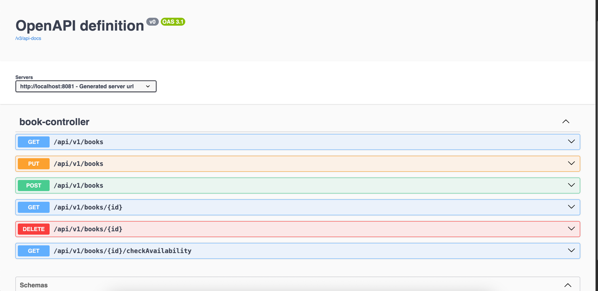
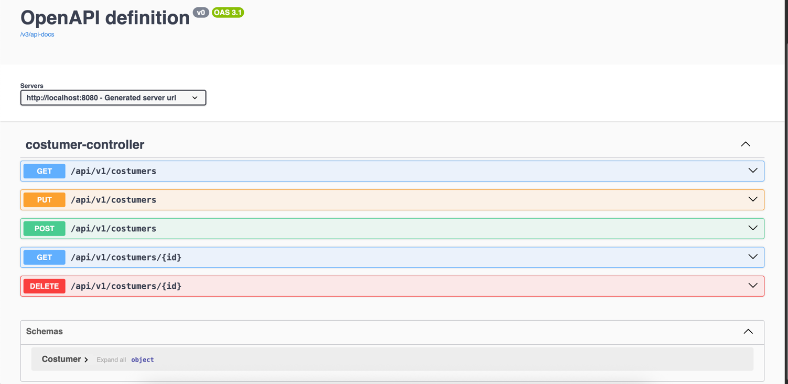
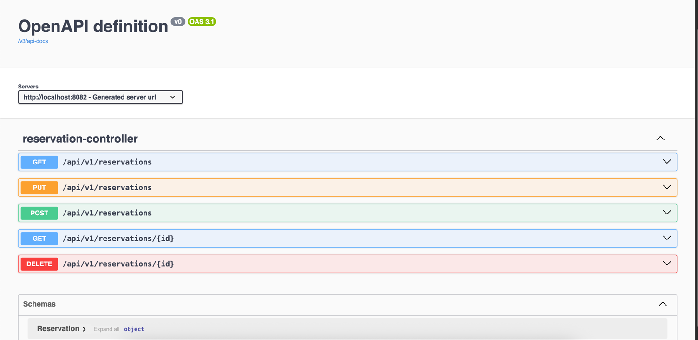

# Book Rental Application

This project is a book rental system built using a microservices architecture. It consists of three main microservices:

## Microservices

### 1. Book Service

Manages book inventory, details, and availability.

### 2. Costumer Service

Handles customer information, registration, and management.

### 3. Reservation Service

Manages book reservations, rental periods, and returns.

## Running the Application

Each microservice is a separate Spring Boot project. Navigate to the respective folder (`book/`, `costumer/`,
`reservation/`) and use the following commands to build and run each service:

```
# Build the service
mvn clean install

# Run the service
mvn spring-boot:run
# or
java -jar target/<service-name>-0.0.1-SNAPSHOT.jar
```

Refer to the individual README files in each service folder for more details.

## API Visualization

The API endpoints for each microservice are documented and visualized using Swagger UI (Springdoc OpenAPI). After
starting a service, access its Swagger UI at:

- Book Service: http://localhost:<book-port>/swagger-ui.html
- Costumer Service: http://localhost:<costumer-port>/swagger-ui.html
- Reservation Service: http://localhost:<reservation-port>/swagger-ui.html

## API Documentation Screenshots

Below are actual screenshots from Swagger UI for each microservice, located in the `docs/screenshots` directory. These
illustrate the available REST endpoints and their documentation as exposed by Spring Boot and Springdoc OpenAPI.

### Book Service Endpoints



### Costumer Service Endpoints



### Reservation Service Endpoints


